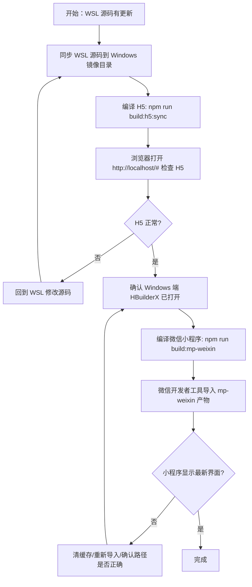

> 对话笔记直发：5.31 手动操作流程总结。分类：小程序接单。

下面是这次我做的事，以及你以后手动怎么做。

---

## 我刚才做了什么

### 1) 把 WSL 最新代码同步到 Windows 镜像目录
- 源码主目录：
  - `/opt/yoshop/yoshop2.0-uniapp`
- Windows 镜像目录：
  - `D:\Program\0\home\0\yoshop1\yoshop2.0-uniapp`

我做的是**单向同步**，把 WSL 最新代码覆盖到 Windows 镜像目录，避免小程序编译还在吃旧代码。

---

### 2) 重新编译 H5 并同步到 `public`
执行了：
```bash
cd /opt/yoshop/yoshop2.0-uniapp
npm run build:h5:sync
```

它做了两件事：
- 编译 H5
- 把 H5 产物同步到：
  - `/opt/yoshop/yoshop2.0/public`

这样浏览器访问 `http://localhost/#` 就能看到最新页面。

---

### 3) 重新编译 Windows 镜像目录下的微信小程序
执行了：
```bash
cd /mnt/d/Program/0/home/0/yoshop1/yoshop2.0-uniapp
npm run build:mp-weixin
```

这次我还顺手修了脚本逻辑，避免以前那种"假成功"：
- 先确保 HBuilderX 打开
- 再执行微信小程序编译
- 如果 HBuilderX 没打开，脚本直接失败，不再假装编译成功

---

### 4) 检查产物是否真的更新
我检查了：
- Windows 镜像源码时间戳
- H5 产物时间戳
- 微信小程序产物时间戳

确认它们都更新到了最新版本。

---

## 如果你手动去做，应该怎么做

你可以按下面这个固定流程操作。

---

# 手动执行流程图



---

# 每一步的具体说明

## 步骤 1：确认 WSL 代码已经更新
你先在 WSL 里改代码。

常用改动位置：
- `pages/`
- `components/`
- `App.vue`
- `config.js`
- `core/`
- `utils/`

---

## 步骤 2：把 WSL 源码同步到 Windows 镜像目录
### 目的
让 Windows 小程序编译吃到最新代码。

### 手动执行
```bash
rsync -a --delete --exclude 'node_modules/' --exclude 'unpackage/' --exclude '.git/' /opt/yoshop/yoshop2.0-uniapp/ /mnt/d/Program/0/home/0/yoshop1/yoshop2.0-uniapp/
```

### 说明
- 这是**单向同步**
- 只从 WSL → Windows
- 不要反向改 Windows 镜像目录里的源码

---

## 步骤 3：编译 H5 并同步
### 手动执行
```bash
cd /opt/yoshop/yoshop2.0-uniapp
npm run build:h5:sync
```

### 作用
- 生成 H5 产物
- 自动同步到 `public`

---

## 步骤 4：浏览器检查 H5
### 打开地址
```text
http://localhost/#
```

### 看什么
- 页面是不是最新
- 样式是否正常
- 数据是否正常
- 首页有没有加载态/报错

### 如果不对
回到步骤 1 修改源码，再重新走一遍 H5 编译。

---

## 步骤 5：确认 Windows 端 HBuilderX 已打开
### 很关键
微信小程序这条线现在依赖 HBuilderX。

### 规则
- **先打开 HBuilderX**
- 再编译小程序

如果没开，脚本会直接失败，不再假成功。

---

## 步骤 6：编译微信小程序
### 手动执行
在 Windows 镜像目录里运行：
```bash
cd D:\Program\0\home\0\yoshop1\yoshop2.0-uniapp
npm run build:mp-weixin
```

### 编译结果目录
```text
D:\Program\0\home\0\yoshop1\yoshop2.0-uniapp\unpackage\dist\dev\mp-weixin
```

---

## 步骤 7：微信开发者工具导入产物
### 导入目录
```text
D:\Program\0\home\0\yoshop1\yoshop2.0-uniapp\unpackage\dist\dev\mp-weixin
```

### 注意
不要导入：
- WSL 路径
- 旧镜像目录
- 其他副本目录

---

## 步骤 8：如果还是旧界面，怎么排查
按这个顺序查：

1. 是否导入了正确目录
2. 是否清了微信开发者工具缓存
3. 是否重新编译过小程序
4. Windows 镜像目录源码是否已同步
5. 产物时间戳是否更新
6. HBuilderX 是否真的打开

---

# 最短手动版流程

如果你只想要最少步骤，就按这个来：

```bash
# 1. 同步源码
rsync -a --delete --exclude 'node_modules/' --exclude 'unpackage/' --exclude '.git/' /opt/yoshop/yoshop2.0-uniapp/ /mnt/d/Program/0/home/0/yoshop1/yoshop2.0-uniapp/

# 2. 编 H5
cd /opt/yoshop/yoshop2.0-uniapp
npm run build:h5:sync

# 3. 编小程序
cd /mnt/d/Program/0/home/0/yoshop1/yoshop2.0-uniapp
npm run build:mp-weixin
```

然后：
- H5 看 `http://localhost/#`
- 小程序用微信开发者工具打开 `mp-weixin`

---

如果你要，我还可以把这份流程进一步整理成一版**更适合长期贴在项目里的"开发操作手册"**。


---

---
**相关**： [[00-索引-小程序接单索引]] [[7.16 YoShop服务订单权限、版权移除与WSL云端发布收口]]
