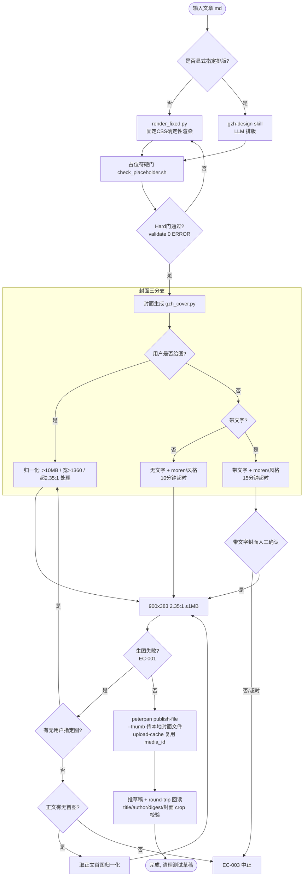

> 对话笔记直发：8.13 公众号发布工作流v5改造。分类：AI工程。

---
title: 公众号发布工作流v5改造
tags: [公众号, 工作流, Hermes, 封面AI化, 固定CSS排版, step-image-edit-2, render_fixed, gzh_cover]
date: 2026-08-13
---

# 公众号发布工作流 v5 改造（已实施并验收）

## 背景与目标
NAS jp（局域网，IP 掩码 192.168.*.*）上 Hermes 的公众号发布工作流从 v4 升级到 v5：
1. 封面 AI 化：整合 step-image-edit-2 生图模型
2. 排版双路径：默认固定CSS确定性渲染（render_fixed.py），显式指定才走 gzh-design skill
3. 落地第一性原理审查前 3 项优化（凭证收口/模型兜底/token节省）

## 关键实测发现
- **stepfun API size 参数语义转置**：请求 `1360x768` 实际返回竖版 `768x1360`；请求 `768x1360` 才返回横版 `1360x768`。脚本内已固化 `768x1360`。
- **Pillow**：12.2.0 已装在 hermes venv（`/opt/hermes/.venv/bin/python`），系统 python3 无 PIL。RK3566（4×Cortex-A55 @1.8GHz，非 RK3399）实测单张裁剪+压缩 0.30s / 峰值内存 5MB，不影响在跑服务；批量需串行。
- `quality:"high"` 参数 API 接受（200）。
- peterpan `--thumb` 只接受**本地封面文件**（走 upload-cache 复用 media_id），不接受 media_id 字符串（会报 40007）。

## 落地物（jp：/opt/data/skills/wechat-publish-workflow/）
| 物 | 路径 |
|---|---|
| 封面 AI 生成/归一化 | `scripts/gzh_cover.py` |
| 固定CSS渲染器 | `scripts/render_fixed.py` |
| 占位符硬门 | `scripts/check_placeholder.sh` |
| 主题存档（存档非源） | `references/fixed-business.css.md` |
| 编排层 v5 | `SKILL.md`（v4 已备份 SKILL.md.v4.bak） |

凭证：`/opt/data/.wechat-publisher/stepfun.json`（600，hermes，key 掩为 xxxx；微信凭证 config.json 亦存在）

## 封面三分支逻辑（用户拍板）
| 输入 | 行为 |
|---|---|
| 默认 | 无文字 + moren（自动推断） |
| 文字+无风格 | 文字 + moren |
| 文字+风格 | 文字 + 指定风格（minimal/tech/oilpaint/watercolor/ink/vintage） |
| 风格+无文字 | 无文字 + 指定风格 |
| 用户给图 | 跳过生图，归一化（>10MB/宽>1360/超2.35:1 处理，极端竖图提示确认） |

- 裁剪：1360x768 沿高向居中裁 1360x579 → 900x383（2.35:1，微信首图标准）≤1MB
- 带文字封面**必须用户人工确认**（15 分钟内超时默认中止；无文字 10 分钟）
- 生图失败 EC-001 回退链：用户指定图 → 正文首图 → 无图则中止不建草稿

## render_fixed.py 要点
- 深炭灰蓝/商务沉稳版，常量唯一事实源在脚本内
- 全文本叶 `` + 结构容器 section/p/ul/ol/li/table/tr/td/th + h1-h6/a/img + 纯 span 语义（禁 strong/em/del/blockquote/pre）
- 代码块每行一个 p（禁 pre），前导缩进转全角 U+3000
- 26 种 callout 全量配色
- 占位符 `{{作者名}}`/`{{简介}}`：未传参 fail-fast 报错退出；先替换后全角化；值单次 HTML 转义（防双重转义）；引号前后文区分
- 输出自带 validate 0 ERROR + check_placeholder.sh 硬门
- 裸 URL 会被全角化破坏（`http：//` 不可点）——已知建议优化，未阻塞

## check_placeholder.sh
单一脚本三处复用（render_fixed 自检/发布前硬门/验收0），精确匹配 `{{作者名}}`/`{{简介}}`，不误伤代码块内 `{{cmd}}`。

## 质量流程（6 轮方案评审 + 2 轮代码复核）
- 方案 v5→v5.6：M1-M7、占位符 fail-fast、全路径硬门、全 span 允许清单、用户否决分支 EC-003、超时分钟数、callout 26 种
- 子代理复核 NEED-FIX 6 项全部修复并二审 READY：MF-1 占位双重转义、MF-2 宽图非等比拉伸、MF-3 代码缩进全角、MF-4 多级列表、MF-5 gzh-design 占位策略、MF-6 超时写死

## 端到端验收（通过）
《v5 工作流验收测试》真实推入草稿箱，round-trip 回读确认：title/author/digest、全 span 内联样式、代码全角缩进、callout、封面 media_id + cover_info（2.35_1 与 1_1 crop）全部正确；测试草稿已删除。带文字封面经用户人工确认通过。

## 待办 / 建议优化（未做）
- [ ] render_fixed 裸 URL 全角化保护（INLINE 加 bare-URL 分支）
- [ ] 有序列表忽略原文数字（统一按缩进级重排）
- [ ] validate 脚本路径硬编码改为常量集中管理
- [ ] S4 完整 `--normalize` 统一管线（强制裁 2.35:1、二次生成缓存）列为下一期
- [ ] 封面二次生成缓存、baoyu-cover-image 5D 参数化、CSS 主题注册进 gzh-design theme-index 互通、公众号数据回流

---

## 发布工作流 v5 流程图

---
**相关**：[[8.12 任务分层v5端到端实施与Hermes对齐]] [[8.13 Hermes 网关免费模型自动切换与报错修复]] [[8.13 公众号发布工作流v5 Hermes接手文档]] [[对话笔记全量梳理表]]
