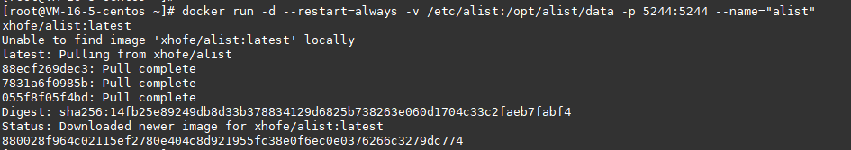
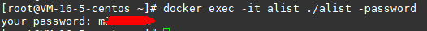
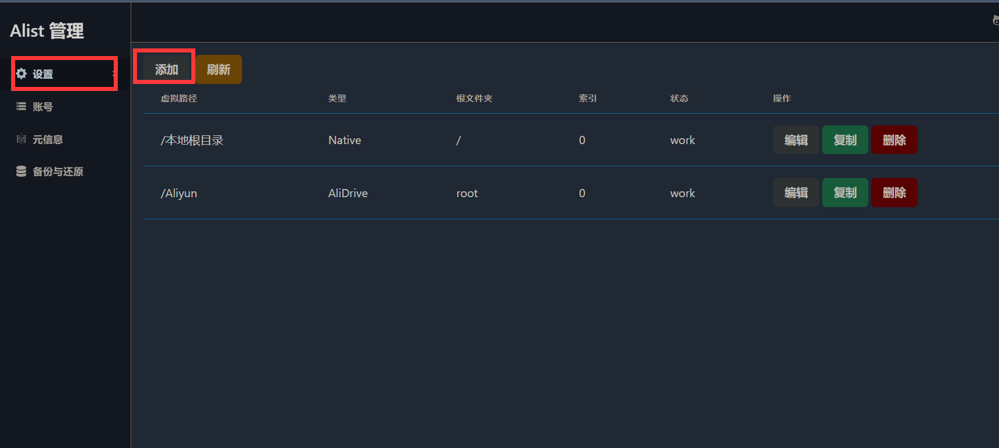
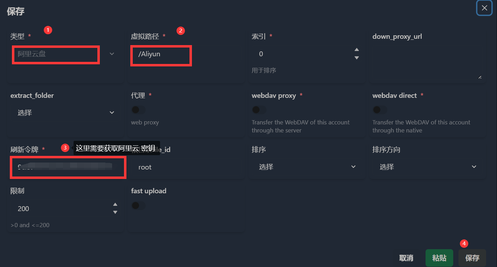
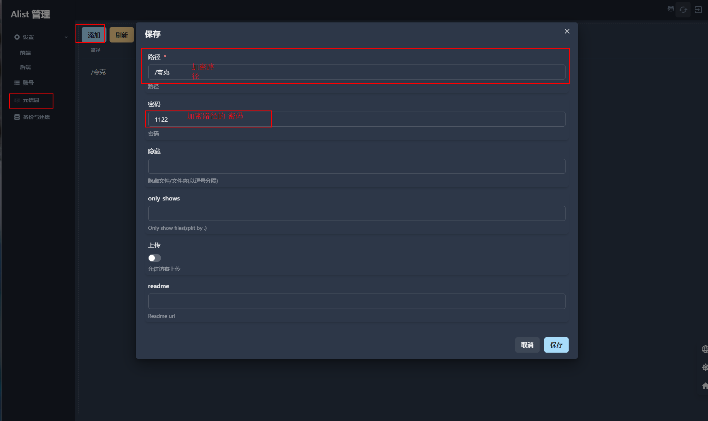

# Alist 挂载阿里云盘 + 夸克云盘（NAS Docker）

> 原载博客园（2022-09-06，阅读 7416）。Alist 版本迭代快，参数以官方文档为准，这里留流程骨架。

## Docker 安装

```bash
docker run -d --restart=always \
  -v /etc/alist:/opt/alist/data \
  -p 5244:5244 --name="alist" xhofe/alist:latest

docker exec -it alist ./alist -password   # 查看初始密码
```





## 挂载阿里云盘

按官方 driver 文档配；扫码拿不到 token 时可用第三方 `decode_token` 工具辅助获取。





## 挂载夸克

登录夸克网页版 → F12 抓 token 填入对应字段。

## 首页加密

见官方 `features/encrypt` 文档，给首页/目录加密码，防裸奔。



---
**相关**： [[00-索引-玩机NAS索引]] [[5.8 JP NAS 本地部署 Kimi GLM 统一网关]]
