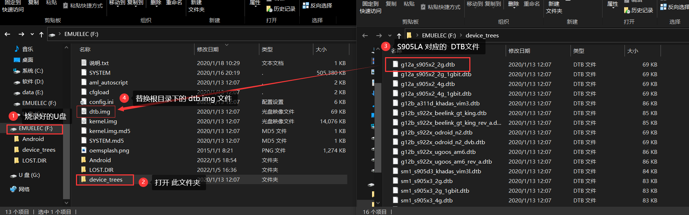
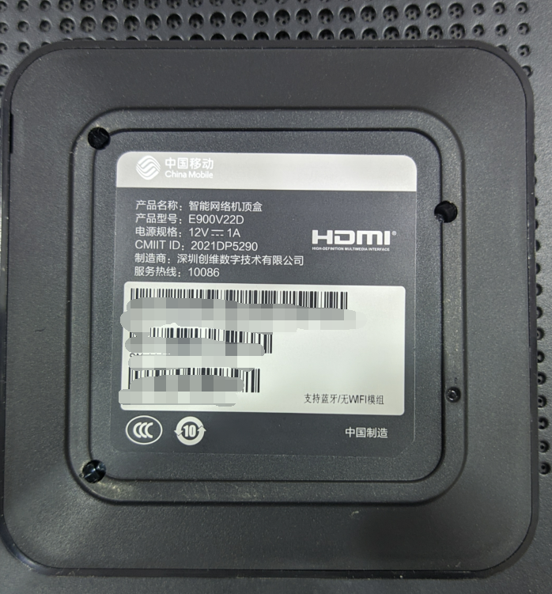

# E900V22D 刷入 EmuELEC 游戏系统

> 原载博客园（2022-10-04，阅读 7837）。

## 配置

E900V22D，晶晨 S905LA，2G + 8G，USB2.0×2 + 百兆网卡 + 蓝牙（无 WiFi、无 TF 卡槽）。

## 准备

- 游戏镜像 `xx.img`、≥64G U 盘、balenaEtcher

## 刷入 EmuELEC

1. balenaEtcher 把镜像写入 U 盘。
2. dtb 选择：用 s905x2-s905x3 镜像，取第一个 `g12a_s905x2_2g` 的 dtb 改名 `dtb.img`，放 EmuELEC 分区根目录。
3. U 盘插盒子，重新上电，开机按右键（每秒 3 下最佳），等跑码进系统。

## 回血：卡刷当贝系统

自带系统不刷机装不了第三方 App，想干回老本行则卡刷：U 盘格 FAT32，把 `recovery.img`、`update.zip`、`factory_update_param.aml` 拷根目录；盒子接 HDMI/网线/电源保持关机，U盘插靠近网口的口，加电同时按遥控右键（每秒 3 次）引导 REC，约 3 分钟刷完自动重启。设置与恢复出厂密码：10086。

---
**相关**： [[00-索引-玩机NAS索引]] [[E900V22E 刷 armbian && 刷全网通安卓 TV]]
