# E900V22E 刷 armbian && 刷全网通安卓 TV

> 原载博客园（2022-09-22，阅读 16019），迁移时保留原步骤，失效网盘链接已标注。

## 前言

安徽移动创维 E900V22E 盒子，芯片晶晨 S905L2B。目标三连：破解移动系统刷第三方桌面、刷入 armbian（已解决网卡不能驱动问题）、刷安卓 TV 系统。


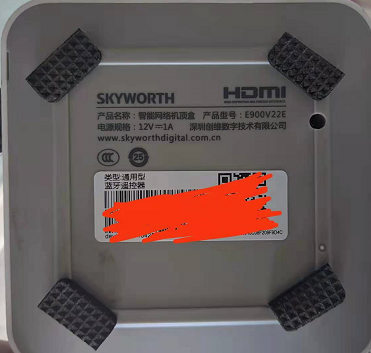
## 一、破解 + 第三方桌面

### 准备工作

- USBFormat.exe（U盘格式化工具）
- 22ES9052B.zip 卡刷包（百度网盘链接已失效，请自行搜索同型号卡刷包）
- 开心电视刷机工具、网线、HDMI 显示器
- 注意：E900V22E 分晶晨 S905-2-B 和海思主控两种，本教程只适用于晶晨版（2+8）


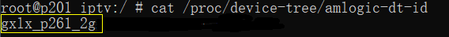
### 步骤

1. U 盘用 USBFormat.exe 格成 FAT32，解压 `22ES9052B.zip` 放 U 盘根目录，插到盒子靠近电源口的 USB 口。
2. 盒子「关于本机」点 7 次版本号开 adb。
3. 开心助手 → 调试 → 进入线刷模式，重启后自动开刷。

adb 常用：

```bash
adb connect 192.168.10.206
adb shell
cat /proc/device-tree/amlogic-dt-id   # 查看芯片
```

参考：ZNDS 相关帖（tv-1218208）。

## 二、刷 armbian（重点：网卡驱动）

老版本 armbian 5.77 能进系统但网口无驱动。解法：在 CSDN 大佬帮助下替换根目录 `u-boot.ext`，用新版 armbian 即可正常驱动网口。


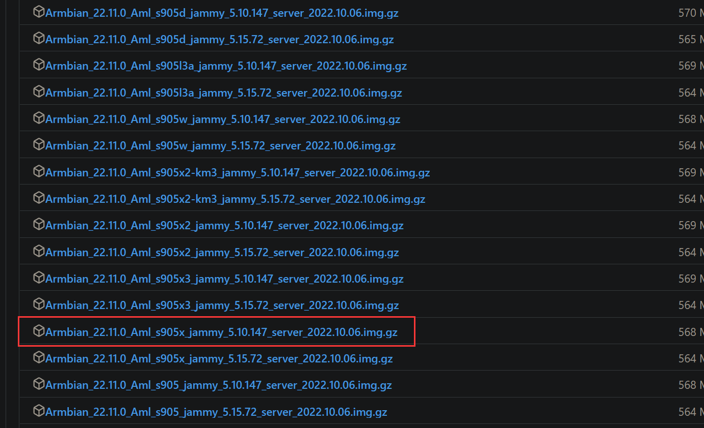

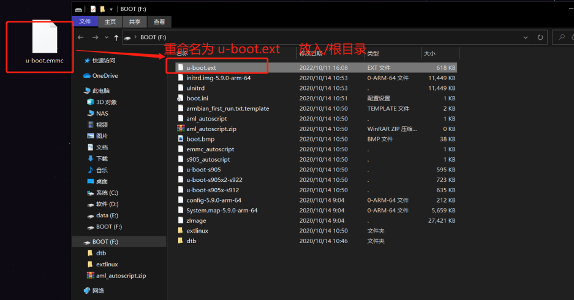

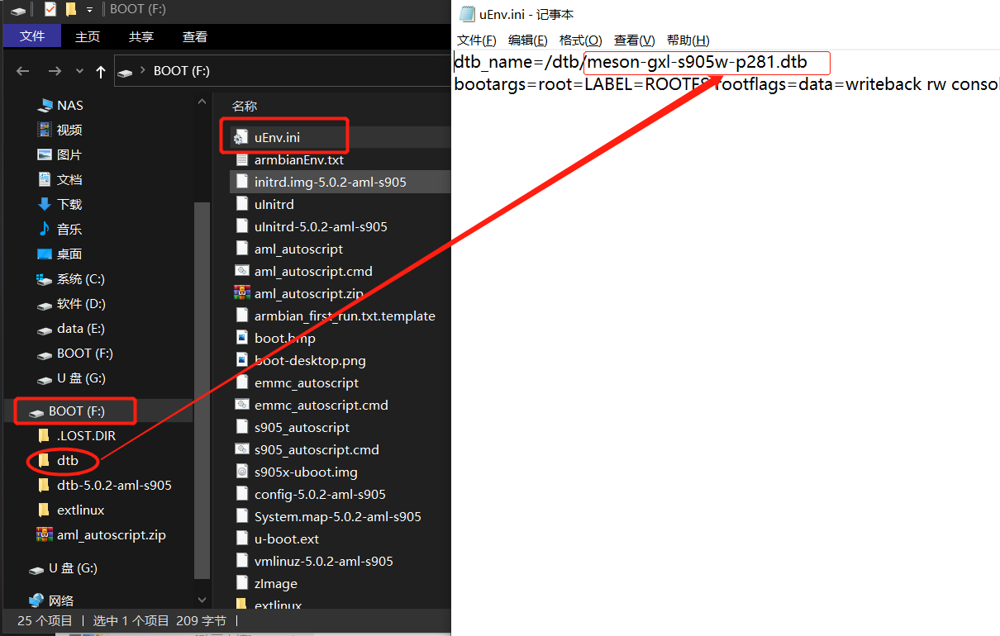

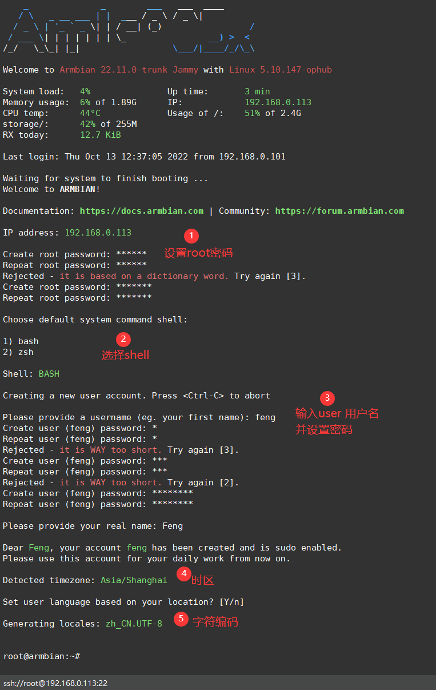

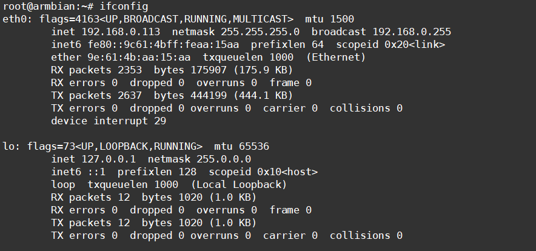

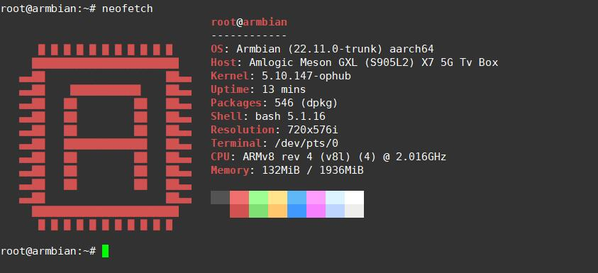
### 准备

- 镜像：`Armbian_22.11.0_Aml_s905x_jammy_5.10.147_server`（ophub amlogic-s9xxx-armbian 仓库找 s905x 5.10）
- balenaEtcher、`u-boot.emmc` 文件

### 步骤

1. balenaEtcher 把 img 写入 U 盘。
2. 用 `u-boot.emmc` 替换 U 盘根目录 `u-boot.ext`（改名保持 `u-boot.ext`）。
3. 改 `uEnv.ini` 第一行 dtb 参数，对应 `/dtb` 下文件，这里用 `meson-gxl-s905l2-x7-5g.dtb`。
4. 盒子断电，U盘插靠近电源的 USB 口，重新上电后狂按遥控器右键进 armbian。
5. 首次启动按提示配置，网口成功获取 IP 即成。

感谢 CSDN 网友 @a520ass。

## 备注

- 百度网盘分享早已失效，刷机包请以 ophub 仓库 + 恩山论坛最新帖为准。
- 刷机有风险，先备份原系统分区。

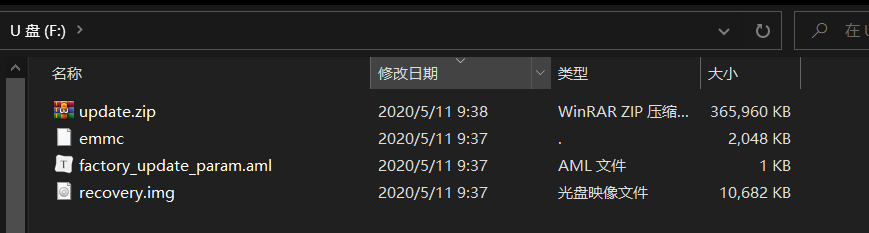

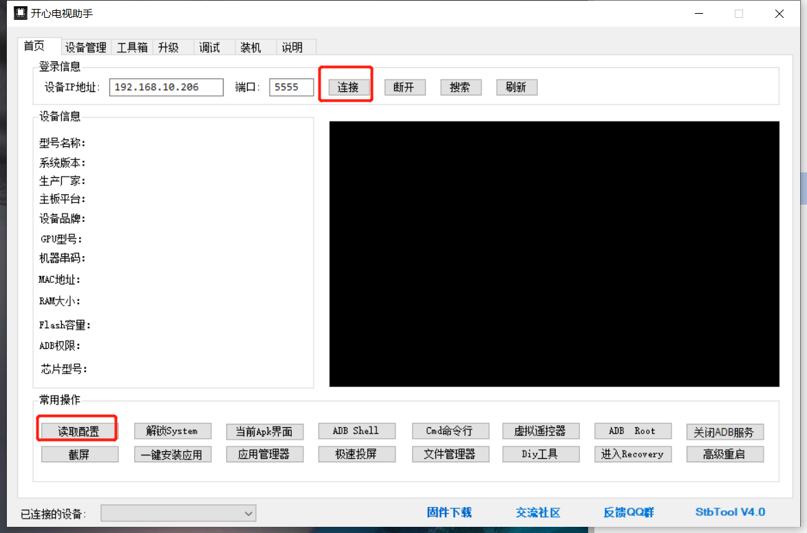

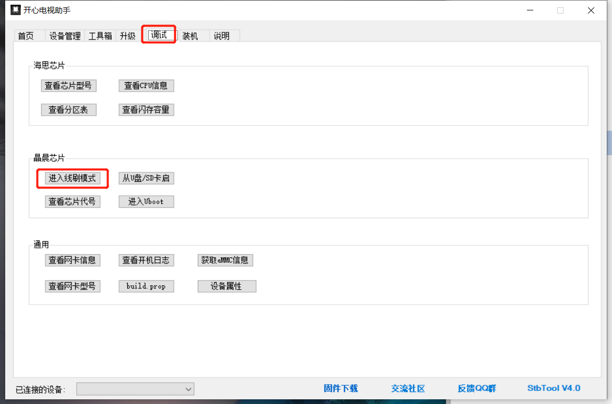
