# 华为悦盒上 Docker 装 HomeAssistant + HACS

> 原载博客园（2022-08-22，阅读 2056）。基于华为悦盒刷的 arm_ubuntu_20.04。

## 换 Docker 源

```json
// /etc/docker/daemon.json
{"registry-mirrors": ["https://9cpn8tt6.mirror.aliyuncs.com", "..."]}
```

```bash
systemctl daemon-reload && systemctl restart docker
```

## 装 ha

跑官方 `install-homeassistant.sh` 一键脚本（按文档选对应设备类型）。


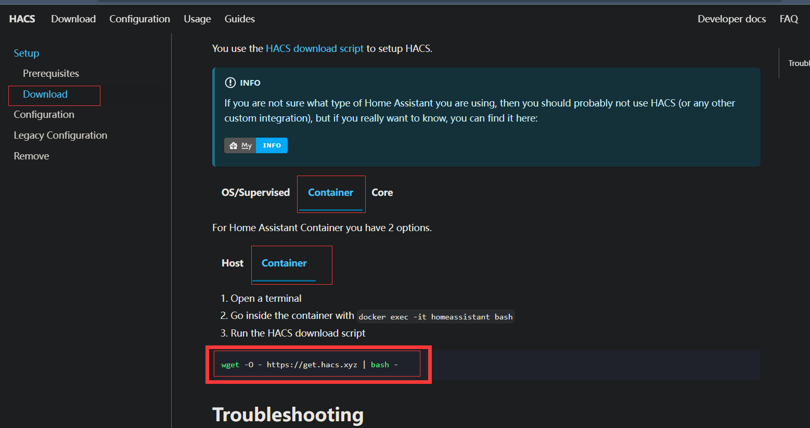

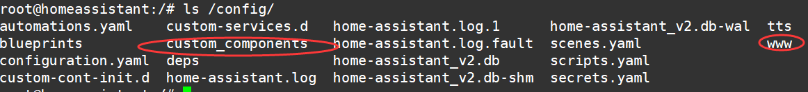

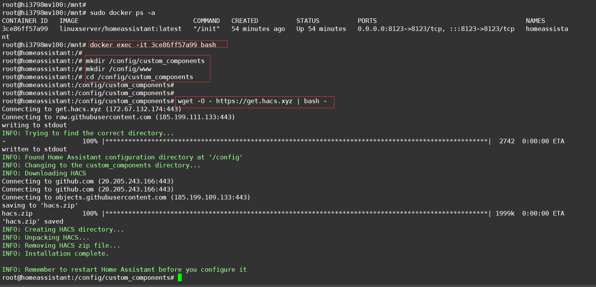

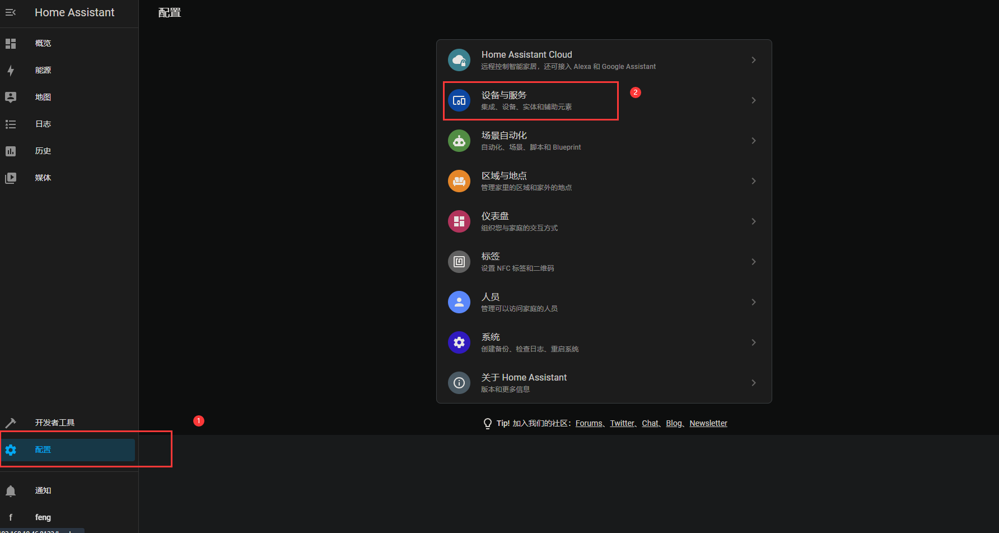

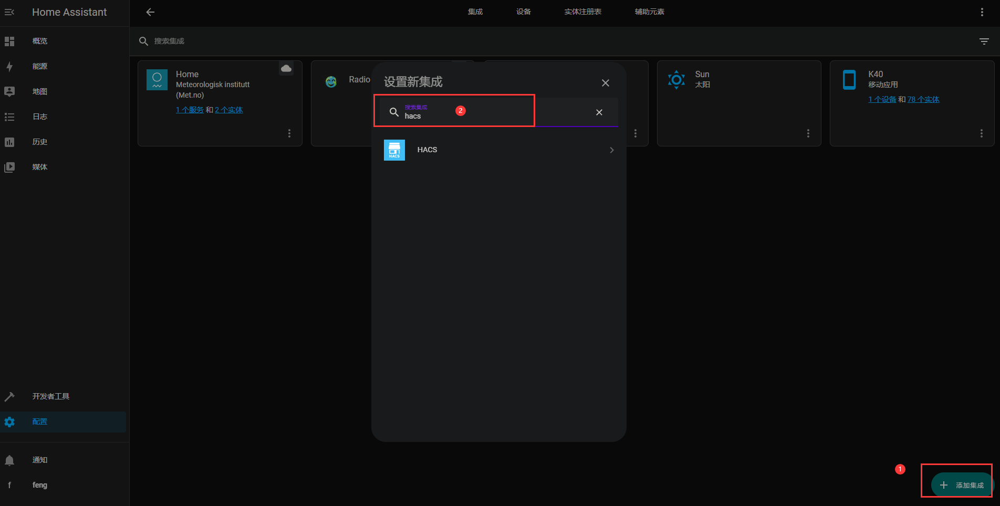

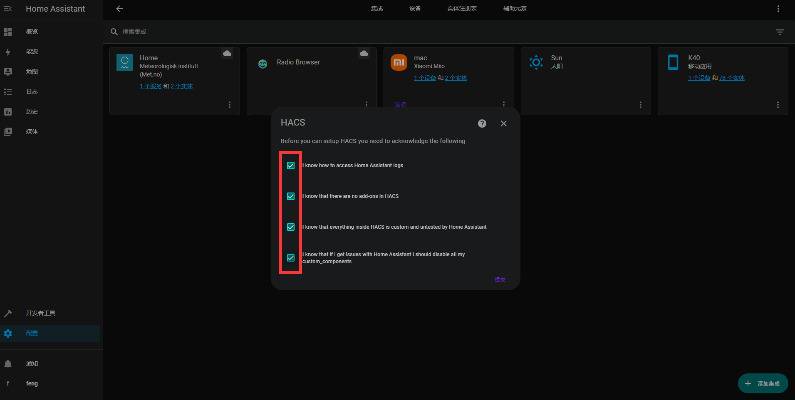

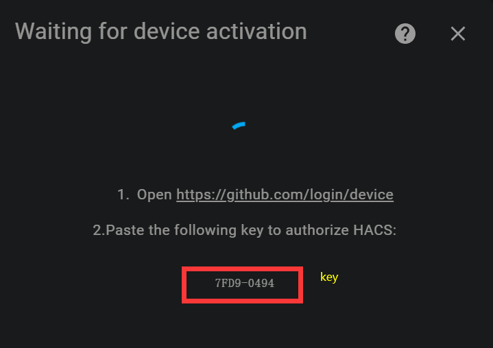


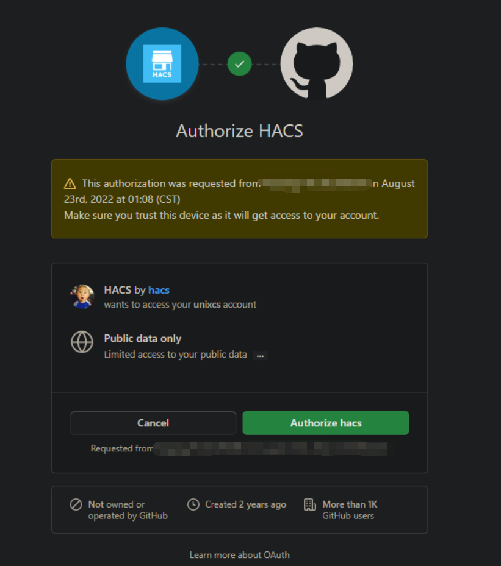

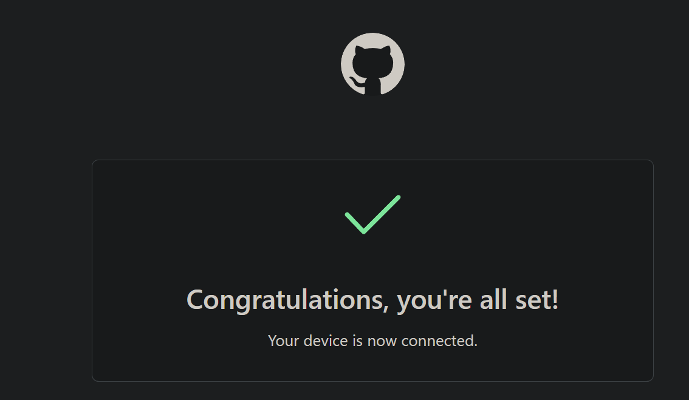

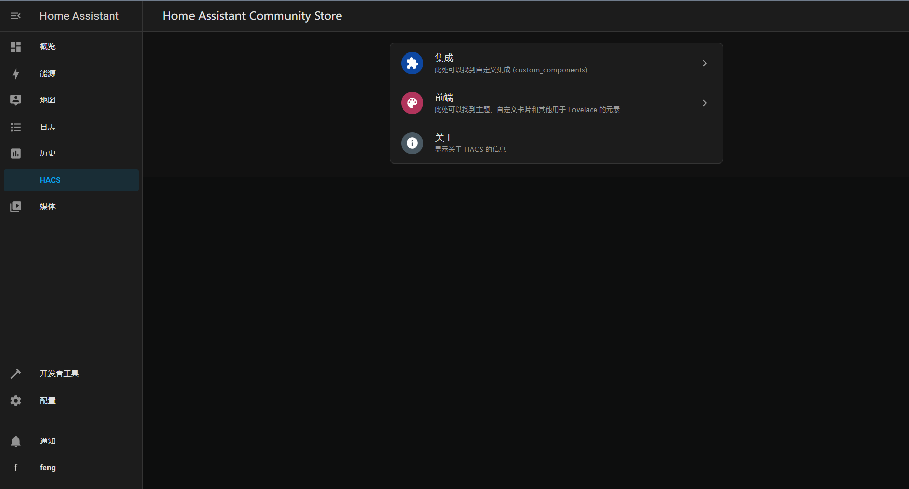
## 装 HACS（第三方插件商城）

```bash
docker exec -it homeassistant bash
mkdir -p /config/custom_components /config/www
cd /config/custom_components
wget -O - https://get.hacs.xyz | bash -
docker restart <ha容器>
```

重启后再登录即可见 HACS 入口，可装各类第三方集成。HACS 安装失败多为网络问题，挂代理或换源重试。

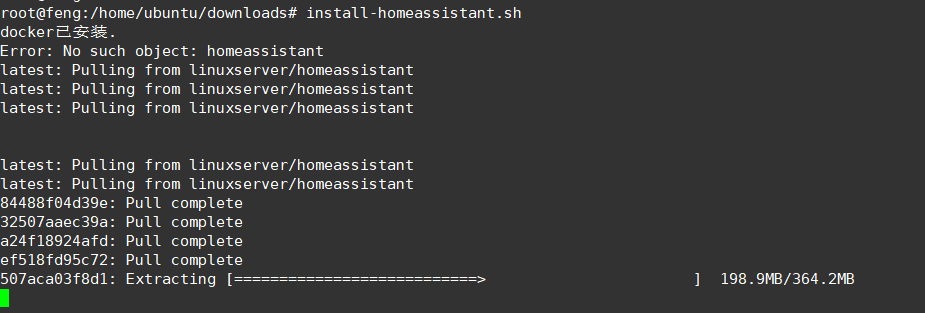

---
**相关**： [[00-索引-玩机NAS索引]] [[随身 WiFi 刷 Debian + Samba 共享]]
