# 华为悦盒 EC6180V9 刷 ubuntu20.04 做 NAS

> 原载博客园（2022-08-16，阅读 7969）。感谢海思机顶盒 NAS 社区与神雕 Teasiu 的开源项目。

## 前言

家里犄角旮旯翻出吃灰多年的移动盒子（EC6180V9，海思芯片，USB2.0×2 + HDMI + SD + Type-C，接口丰富不用转接线），遂刷 linux 做 NAS。

## 开 adb

1. 盒子设置开远程连接，记密码（无密码默认 `.287aW`），盒子与电脑同网段记 IP。
2. STB 工具输入密码开 adb 权限。
3. `adb connect [IP]`，`cat /dev/block/mmcblk0p1 | grep -a hi3798` 确认型号。


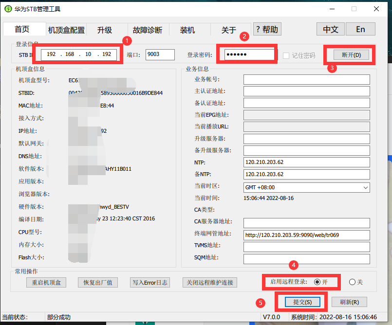

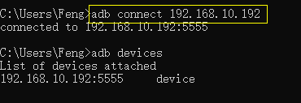

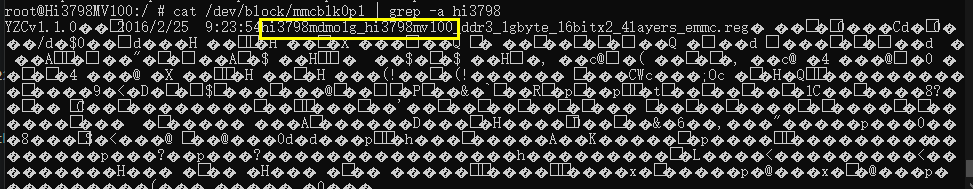
## 备份分区（先备份再折腾）

```bash
adb shell
cd /dev/block && cd platform/soc/by-name && ls -al  # 截图记分区名
df  # 看 U 盘挂载点
dd if=/dev/block/mmcblk0p1 of=/mnt/sda/sda1/mmcblk0p1
# …逐分区 dd 到 U 盘…
```

还原示例：`dd if=/mnt/sda/sda1/system of=/dev/block/mmcblk0p15`。


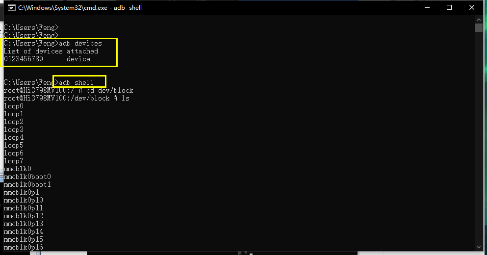


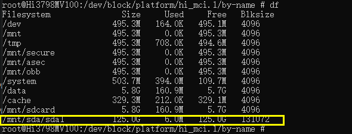

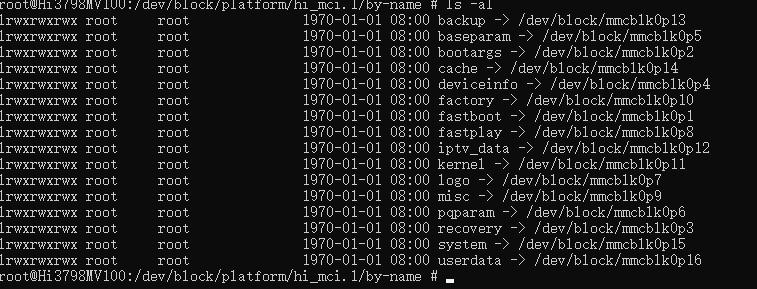
## adb 线刷 ubuntu

原理：adb 进 shell 后用 `dd` 全盘刷写 eMMC。

1. 按型号对照设备适配表下载 `emmc_xxx.img`（我的对应 fastboot 简称 g 结尾），放 U 盘根目录。
2. adb 进 shell，切到 U 盘目录确认镜像在。
3. `dd if=emmc_xxx.img of=/dev/block/mmcblk0`，刷完**等 5 分钟再动**，重启拔 U 盘。
4. SSH：`root/1234`，或浏览器开 `http://ip:7681`。

## 变砖复活：短接 U 盘卡刷（2022-08-30 补）

一次重启变砖，TTL 线在路上，群里得知可短接卡刷：U 盘（16~64G）用 USB_format 专用工具格式化，卡刷包解压放根目录，找到短接点 J16：**断电 → 短接住 → 上电 → 5 秒松开 → 自动刷机**，约 3 分钟出现刷机界面，等作者微信二维码出现即结束。注意：刷机 U 盘接远离电源的口，系统挂载 U 盘接靠近电源的口。

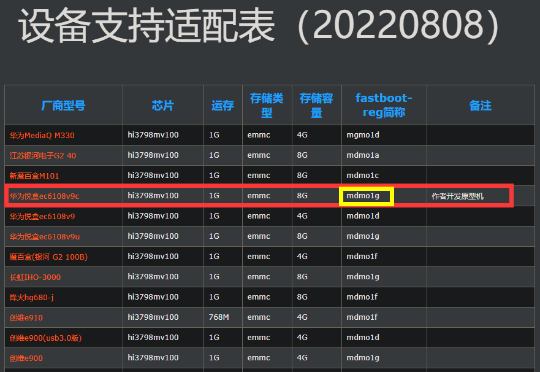

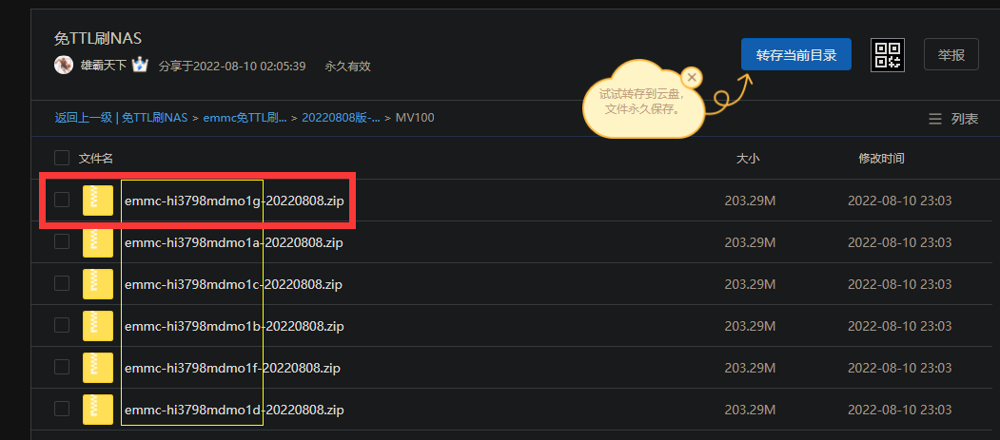

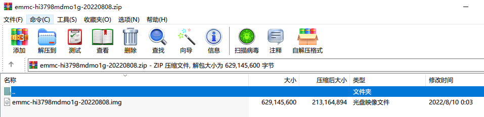

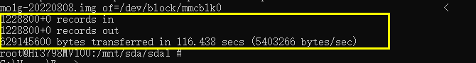

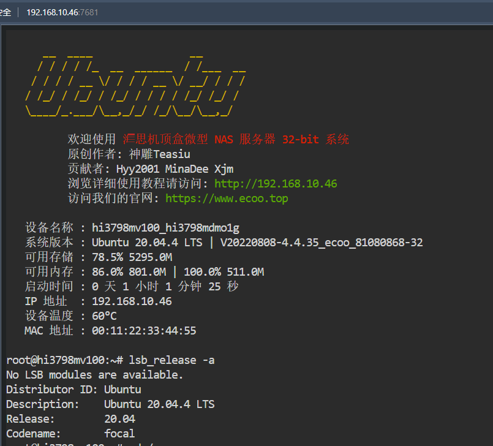

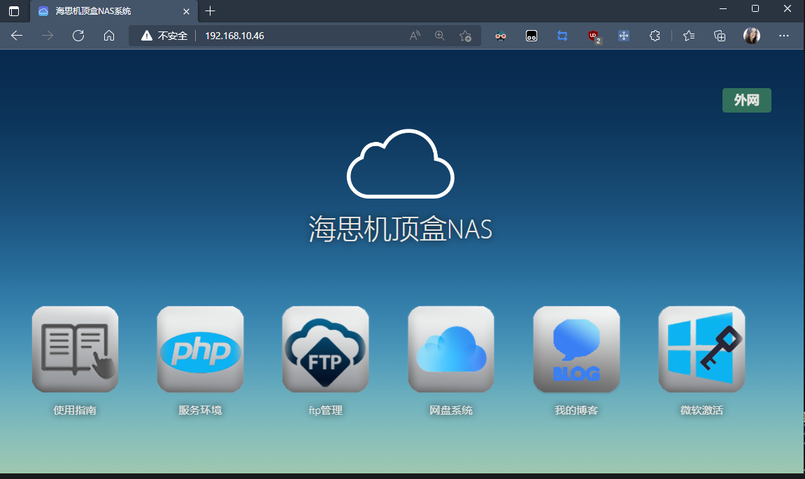

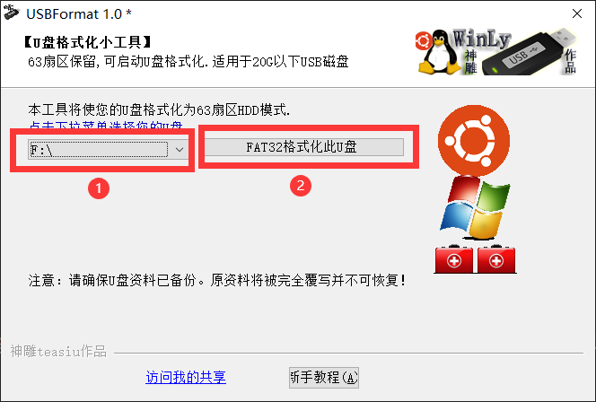

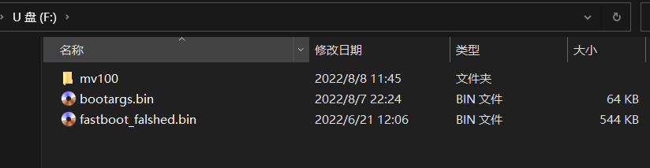

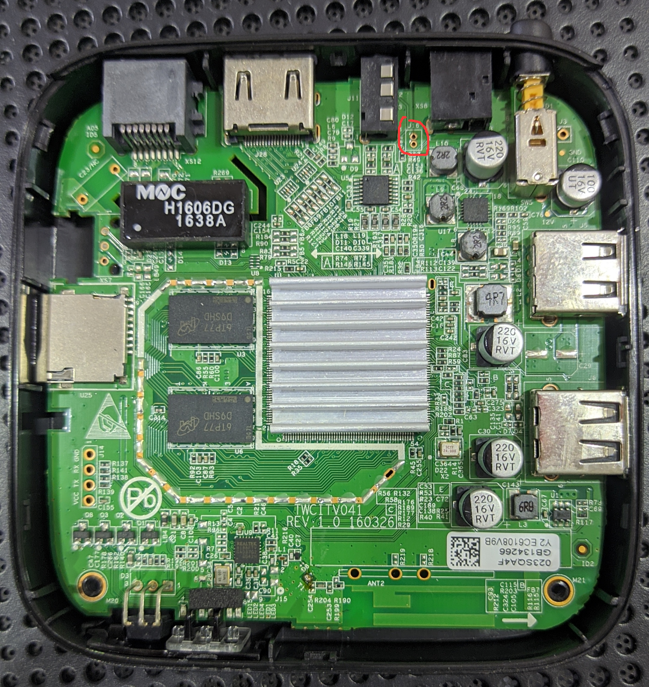


---
**相关**： [[00-索引-玩机NAS索引]] [[京东云无线宝（一代 128G）刷机：编程器刷 Breed 上老毛子/集客]]
