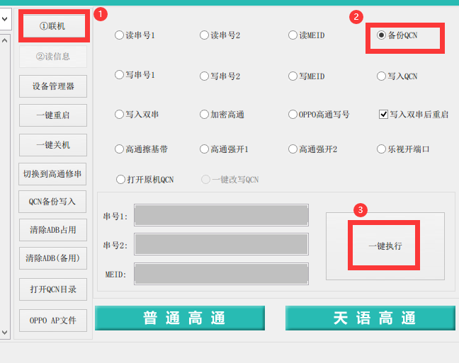
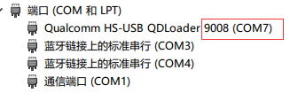
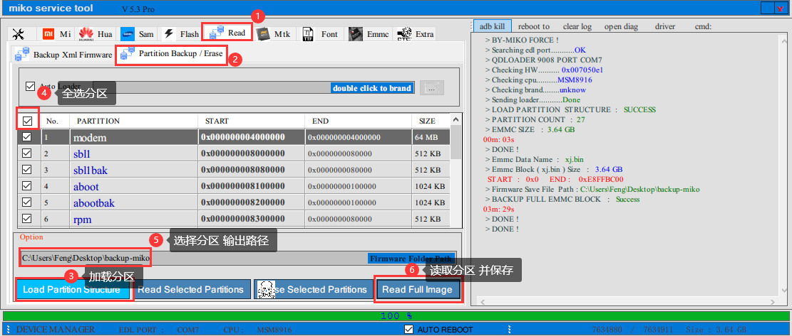
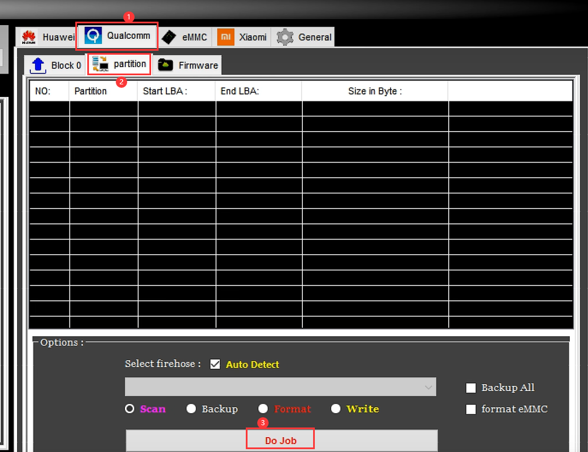
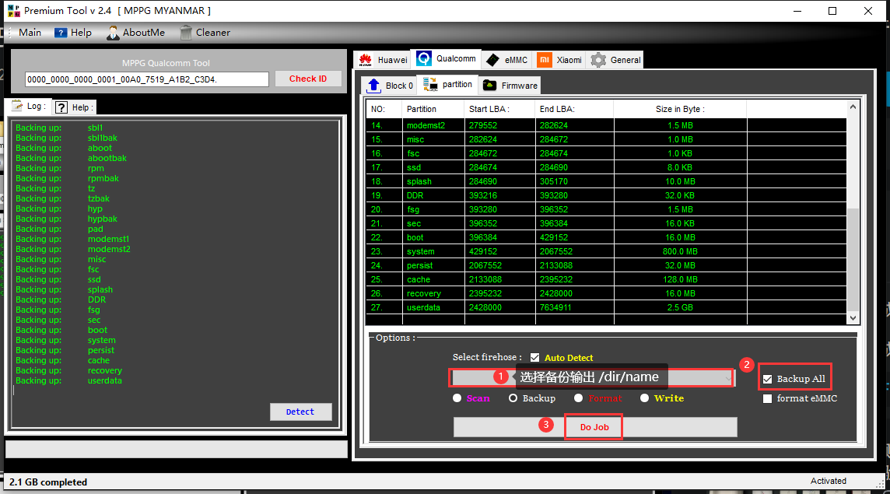
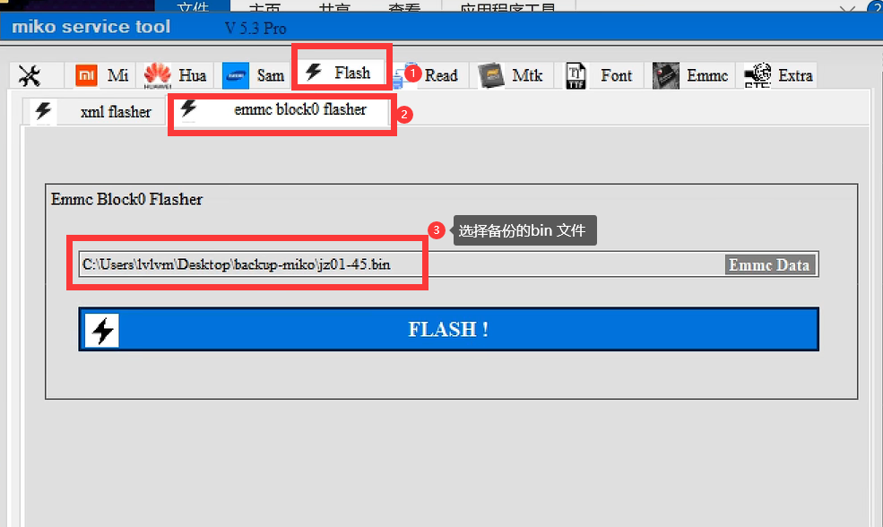
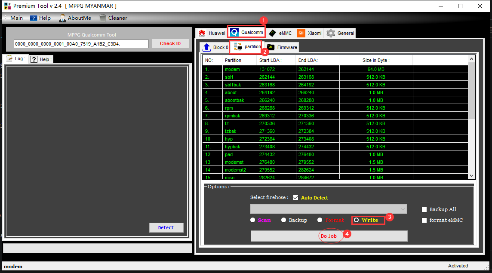

# 随身 WiFi 备份篇：QCN 基带与分区备份

> 原载博客园（2022-08-12，阅读 10646）。刷面具 / openwrt / debian 之前，先把这三样备份做了。

## 三个备份

| 备份 | 工具 | 用途 |
|---|---|---|
| QCN 基带 | 星海工具 | 丢基带=变砖头，必备 |
| 全分区救砖包 | miko | 所有分区压成一个 bin，一键刷回 |
| 独立分区备份 | QPT（Qualcomm Premium Tool） | 27 个分区逐个备，可单独还原 boot/system |

miko vs QPT（个人理解）：miko 是整包救砖，QPT 是精细到分区，两个都做最稳。

## 准备

- 软件：秋之盒（Android 调试，切换 fastboot/9008）、星海工具、miko、QPT V2.4
- 驱动：Qualcomm USB Driver V1.0、vivo9008 drivers、微软软件包

## QCN 基带备份

联机看信息 → 选中备份 QCN → 一键执行，收好文件。

## 分区备份

1. 秋之盒重启进 9008（设备管理器确认显示 9008）。
2. miko：打开工具 → 备份分区，生成救砖包。
3. QPT：读取 → 逐分区备份。

## 还原

短接进 9008 → miko 还原整包，或 QPT 针对单个分区还原。
