# 随身 WiFi 刷 Debian + Samba 共享

> 原载博客园（2022-08-13，阅读 6036）。

## 刷入

准备 miko 第三方包 + debian 刷机包：base 目录跑 `flash.bat`，再进 debian 目录跑对应脚本，装驱动，完事。

## 连上

重拔插后 xshell 连 `192.168.68.1`（默认 user/1）。`sudo nmtui` 图形配网，或 `ifconfig` 查 IP 后换插头用新 IP 连。

基础包 + 时区：

```bash
apt update && apt install curl vim wget cron dnsutils unzip lrzsz fdisk gdisk exfat-fuse exfat-utils -y
dpkg-reconfigure tzdata
```

开主动 USB（可外接 U 盘）：往 `/usr/sbin/mobian-usb-gadget` 写 `host` 到对应 role 节点。

## Samba

```bash
apt install samba samba-common-bin -y
# /etc/samba/smb.conf 加共享段（path=/home，writable=yes）
smbpasswd -a root && sudo samba restart
```

## 坑：fastboot 写入失败

手上先机新款 ufi_16v3，刷第三方包后 adb 正常，但 fastboot 下写入失败。知识补课：adb 是进 system 后的调试工具，fastboot 处于 bootloader 阶段，rec 相当于 PE 分区——写入失败多半和 boot 分区状态有关，换包/换线/换口逐一排除。

资源包（miko 原厂包 + armbian 包）：原 123pan 链接已失效，请自行搜索同型号包。

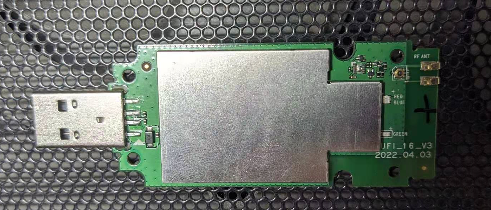

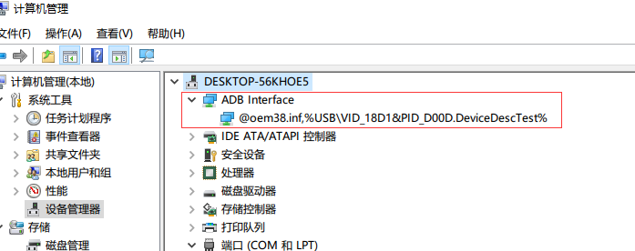

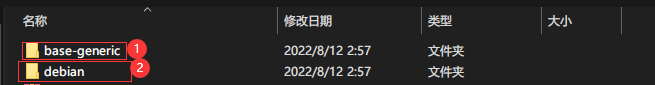

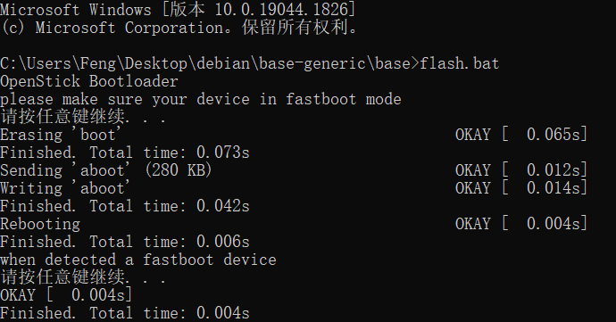

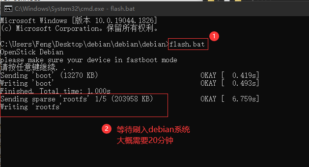

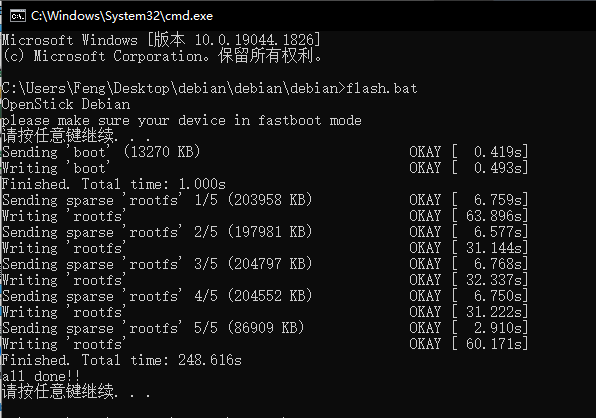

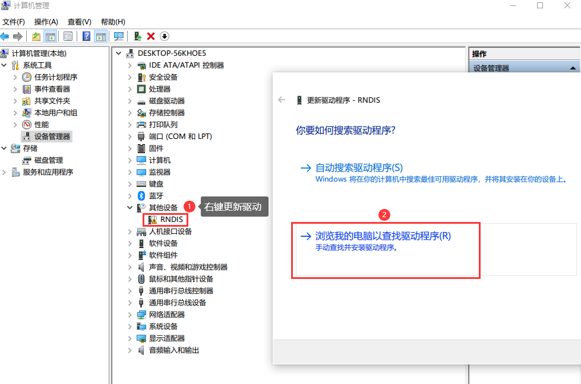

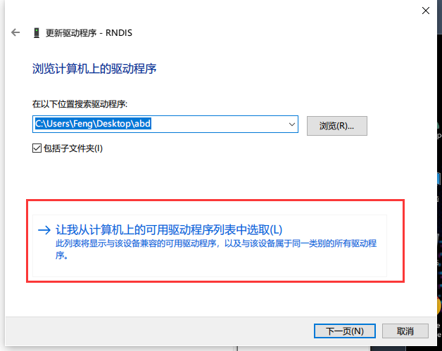

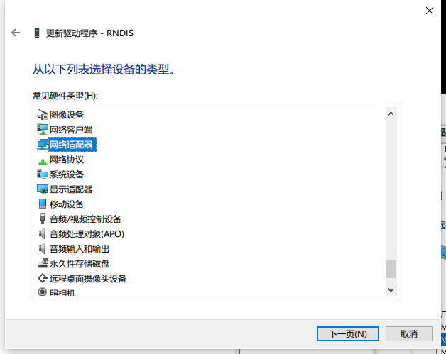

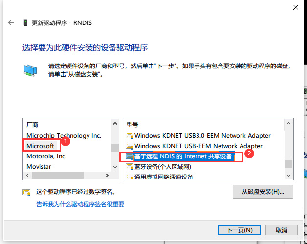

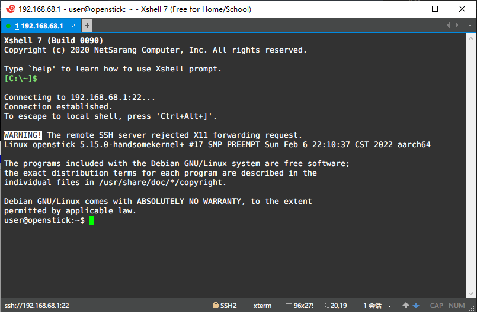

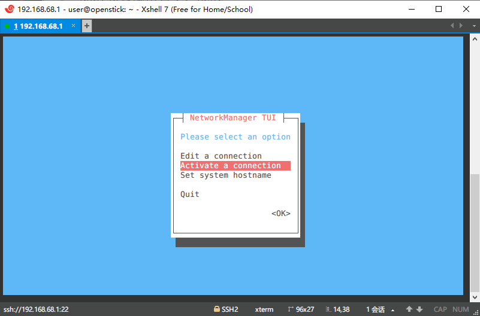

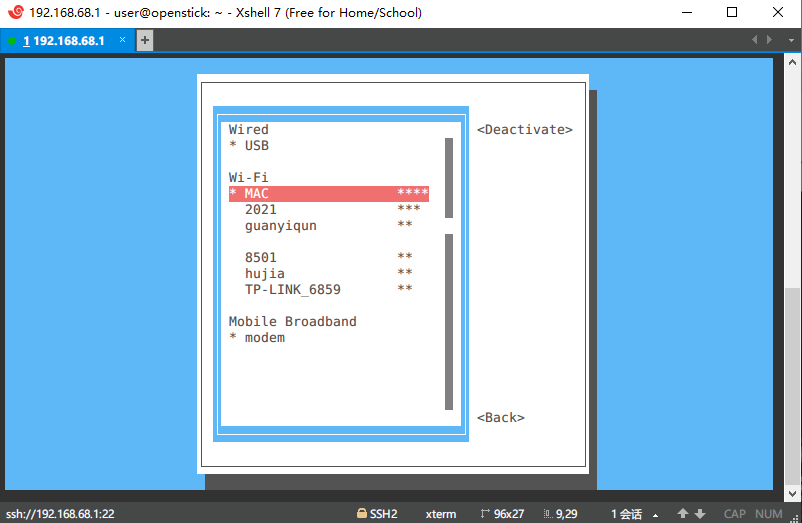

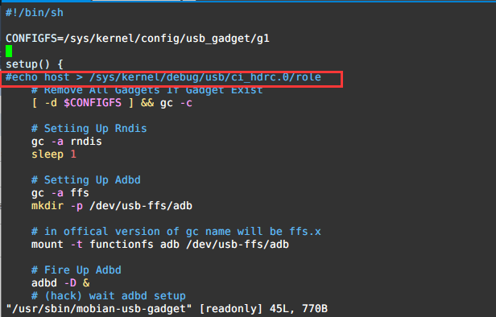

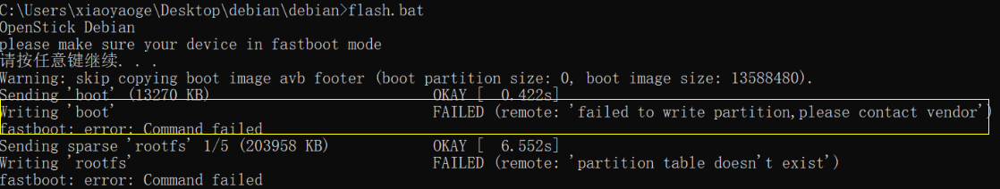

---
**相关**： [[00-索引-玩机NAS索引]] [[随身 WiFi 刷面具拿 Root（uz801）]]
