# 随身 WiFi 刷面具拿 Root（uz801）

> 原载博客园（2022-08-12，阅读 5282）。

## 准备

uz801 棒子、9008 驱动、adb 驱动。后台 `http://192.168.100.1/`（admin/admin），`usbdebug.html` 开 adb。任务管理器关掉占用的 `adb.exe` 再动手。

## 先备份

miko + QPT 把分区（特别是 boot）备好，详见《随身 WiFi 备份篇》。

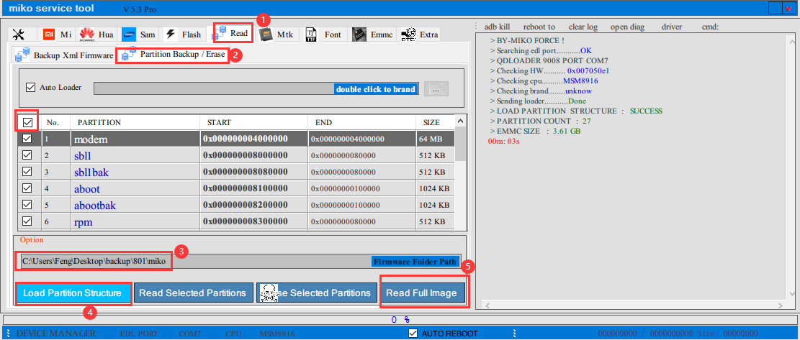

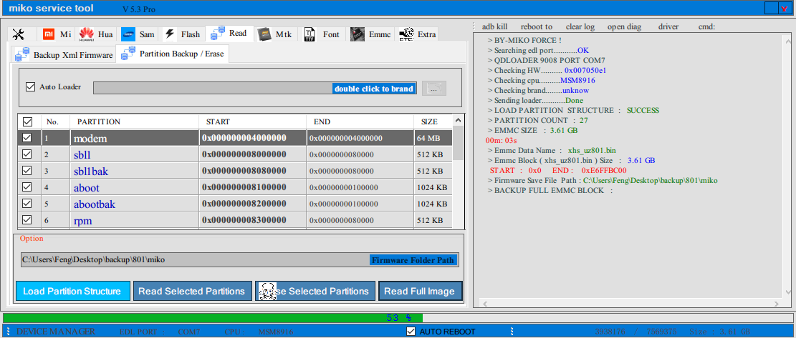
## 刷面具

工具：ardc 投屏、Launcher.apk、magisk.apk、es 文件管理器。

1. PC 装 ardc 投屏到棒子安卓，装 Launcher。
2. 装面具 + es，把 QPT 备份的 `boot.img` 放到下载目录。
3. 面具里选该 `boot.img` 修补，导出 `magisk_patched` 新 boot。
4. 切 fastboot：`fastboot flash boot xxx.img` 刷入修补版，开机即 root，adb 可用。

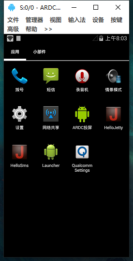

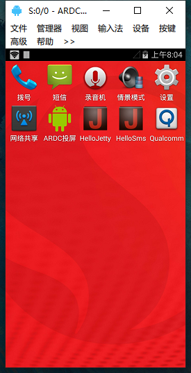

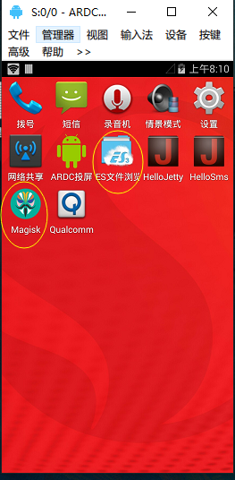

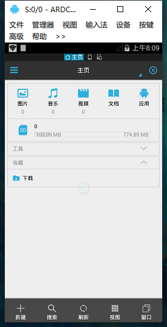

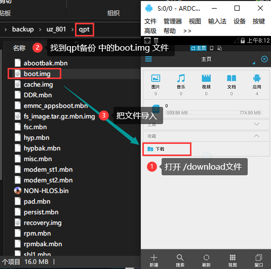

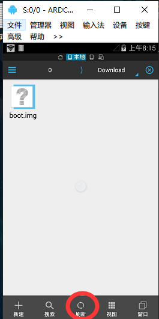

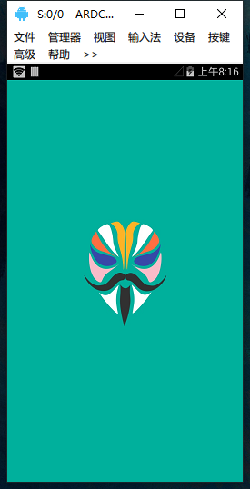

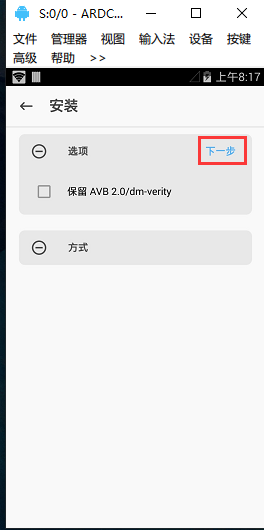

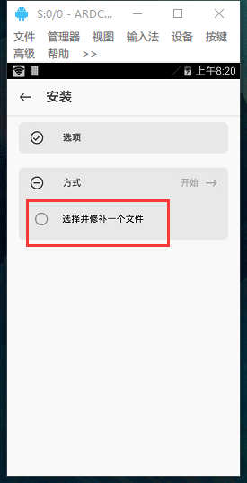

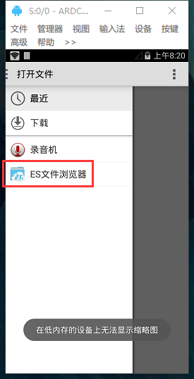

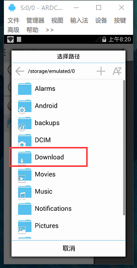

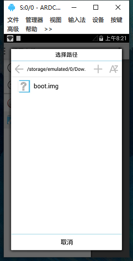
